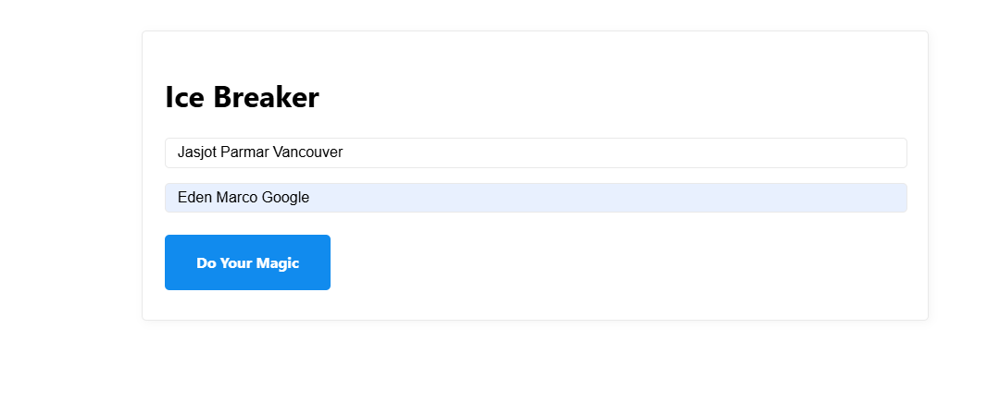
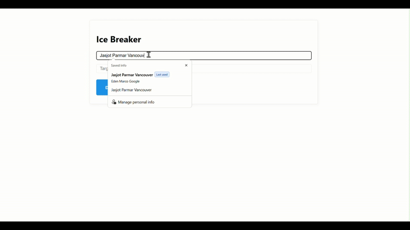

# LinkedIn Ice Breaker

> **AI-Powered Networking Assistant** - Transform cold LinkedIn outreach into warm, personalized conversations with intelligent ice breakers that find commonalities between you and your target person.

---

## Demo Video

---

## What It Does

LinkedIn Ice Breaker is an intelligent networking tool that analyzes two LinkedIn profiles and generates personalized conversation starters. Simply input your name and your target connection's name, and get:

- **Smart Profile Analysis** - Deep insights into professional backgrounds
- **Common Ground Discovery** - Identifies shared experiences, skills, and interests  
- **Personalized Ice Breakers** - Ready-to-send LinkedIn messages under 450 characters
- **Professional Summaries** - Key facts and talking points about your target connection

---

## Key Features

### **Intelligent Agent System**
- **LangChain ReAct Agent** autonomously searches and finds LinkedIn profiles
- **Multi-step agent reasoning** for accurate profile matching
- **Error handling** with graceful fallbacks

### **Profile Processing**
- **Data flattening algorithm** optimizes LinkedIn JSON data for LLM processing
- **Skill extraction** from job descriptions and profile sections
- **Education parsing** with degree and institution mapping and comparison
- **Language proficiency analysis** 

### **Smart Content Generation for LinkedIn DM**
- **GPT-4o integration** for human-like conversation starters
- **Structured output parsing** using Pydantic models
- **Character limit optimization** for LinkedIn DM constraints
- **Tone matching** to maintain professional authenticity

### **Clean User Experience**
- **Responsive web interface** built with Flask
- **Real-time processing** with loading indicators
- **One-click copy** functionality for generated messages
- **Profile photo integration** for visual context

---

## Technical Architecture

### Core Components

- **`agents/linkedin_lookup_agent.py`** - ReAct agent for autonomous LinkedIn URL discovery (using Tavily)
- **`ice_breaker.py`** - Main orchestration logic and LLM chain management to return the result used in the Flask app
- **`output_parsers.py`** - Pydantic models for structured AI responses  
- **`third_parties/linkedin.py`** - LinkedIn profile scraping with Scrapin.io integration
- **`tools/tools.py`** - Tavily search integration for web discovery

---

## Technologies Used

**Backend & AI**
- **Python 3.12+** - Core application logic
- **LangChain** - AI agent framework and LLM orchestration
- **OpenAI GPT-4o** - Advanced language model for content generation
- **Pydantic** - Data validation and structured output parsing
- **Flask** - Lightweight web framework

**External Services**
- **Tavily Search API** - Web search for profile discovery
- **Scrapin.io API** - LinkedIn profile data extraction
- **Vercel** - Serverless deployment platform

**Frontend**
- **Vanilla JavaScript** - Clean, dependency-free interactions
- **MVP.css** - Minimal, semantic styling
- **Responsive Design** - Mobile-first approach

---

## Getting Started

### Installation 

- 1. **Open the site [https://icebreaker-ai.vercel.app](https://icebreaker-ai.vercel.app)**

- 2. **Enter your name and the target name**

- 3. **Click Do Your Magic**

- 4. **Copy the message and paste it into LinkedIn**

---

## Sample Output

**Input**: "Jasjot Parmar, Vancouver" → "Eden Marco, Google"

**Generated Ice Breaker**:
> Hi Eden! I noticed we both have a background in SQL and Python, and I find it fascinating how these skills are applied in different contexts. I'm curious about your experience as a Udemy instructor. What inspired you to start teaching online, and how do you balance it with your role at Google? Looking forward to hearing your insights!

---

## How It Works

1. **Profile Discovery**: Agent searches the web to find LinkedIn profiles matching provided names
2. **Data Extraction**: Scrapes comprehensive profile information using Scrapin.io API
3. **Intelligent Processing**: Flattens and optimizes profile data for LLM consumption
4. **Common Ground Analysis**: Identifies shared experiences, skills, and background elements
5. **Content Generation**: Creates personalized, professional ice breaker messages
6. **User Interface**: Presents results with copy-paste functionality

---

## Author

**Jasjot Parmar**  
Aspiring Data Scientist | Python & Machine Learning Enthusiast | Data Science Graduate Student

🔗 [GitHub](https://github.com/jasjotp) • [LinkedIn](https://www.linkedin.com/in/jasjotparmar)

---
